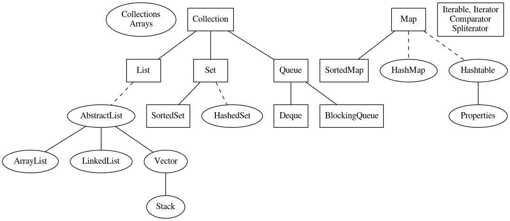

# Java `Collections` Framework

`List`, `Set`, `Map`, and `Queue` are the four fundamental data structures of the Collections Framework. 

`List` and `Set` are both sequences, with the difference that `List` preserves order and allows duplicate entries, whereas Set, true to the mathematical concept behind it, does not. `Map` is a key/value store, also known as a hash, a dictionary, or an associative store. 
Queues are, as the same suggests, structures that you can push into at one end and pull out from the other.

Below Diagram shows some of the important collection-based classes from package `java.util`. It is intentionally not complete due to space limitation.

The Collections Framework: Rectangles are interfaces; ovals classes; Solid lines are inheritance; dashed lines represent implements
